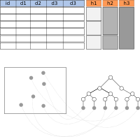
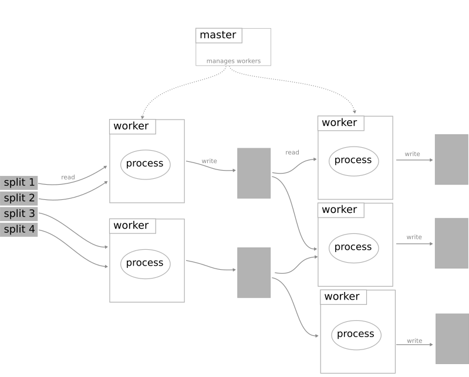
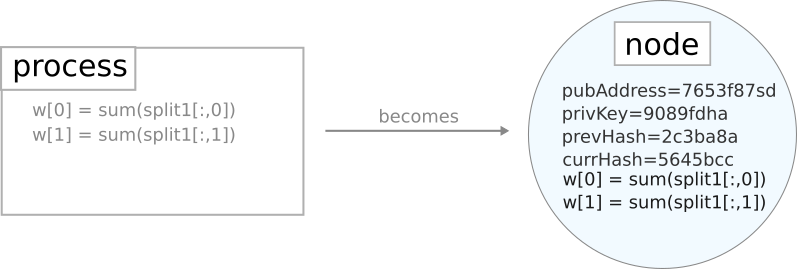
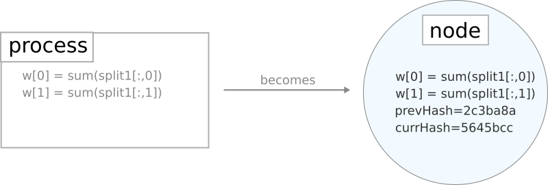

#[WORK IN PROGRESS]
# Blockchain-like Machine Learning
This proposal aims to build a theoretical structure to harden machine learning algorithms against tampering by means of a blockchain-like system.

This proposal makes a focus on distributed processes, which are the type of schemes used in machine learning on big data analysis.

## Motivation
Many modern processes rely, or are in the process of relying, in models that decide what movie to see, what sentence to answer, how probable are that you leave a telephone company, etc. These models are in the field of machine learning.

All of the models contain a set of parameters that define how the algorithm behave and what predictions will do. It is then important to assure these parameters are under control, and are not modify during training, or after it, when the model is deployed.

Current technologies can provide secure communication channels where data can be transfered. Data can also be encrypted in hard disks while resting in there. However, there always exists people with the right privileges to decrypt the disks, or intercept the communications, and modify data at will (probably erasing this modification from logs also). If models' parameters are modified, the predictions made by the models will change and that will affect how the company is making money with them. Models used for profitable purposes cannot be risked by not providing the necessary security

Blockchain is a technology that enables to maintain an unmodifiable data record of communications among nodes in a network. It is then an obvious candidate to secure machine learning algorithms.

In this proposal we are going to explore how a blockchain-like system could be adapted to work on distributed machine learning.

## High-level View

### System Elements

  
* **Data**: machine learning algorithms work with data. An attacker could modified the algorithm's model during the training, by modifiying the data. This would results in a distorted model. To avoid this, data to be fed to a model is prevented from tampering by creating a **Merkle tree** of the data.

    In the figure example, we have data in a table. The data has several columns with features of the data. The same data is represented as gray dots on the bottom part of the figure. With this data, organized by an index *id*, a Merkle tree is calculated. Taking the root node of the tree, and including it in the blockchain assures us that the data cannot be modified.
    
    

        
    

    The size of the tree is aproximately  log2(n) being *n* the number of rows on the table (the number of examples). it is important to notice that data does not hace to be in the blockchain, only its root node hash.

* **Node**: every process in a distributed process scheme, would become a node. Every interaction among these nodes is refered as a *message*. Let us focus on the distributed paradigm for machine learning most used currently, "MapReduce". In this pàradigm, a master cluster node acts as coordinator and deliver processes to worker nodes. These workers read the data, perform their computation (the map part) and write the results in a file. Another set of workers read this data and perform another computation that reduces the number of elements (the reduce part).  Finally they write the results in the disk.

    

            
    

    
    Our approach to harden this paradigm against tampering is to wrap each process in a "bubble" that contains the process to be executed and additional parameters, like a hash of the current process parameters (a current state hash) and a hash of the previous parameters of the preocess (a las state hash). Let us call this wrapper as the *bubble machine*. This bubble are in fact nodes of the blockchain system, so every exchange of information among the "bubbles" are in fact similar to transactions in Bitcoin (here renamed to *messages*).

    

            
    

    Let us see a node example. 

    

            
    
    

* Message

* Blockchain

### MapReduce Paradigm Computations

