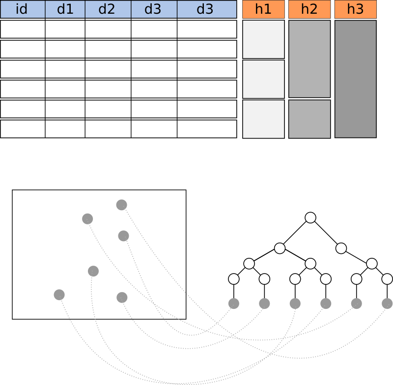
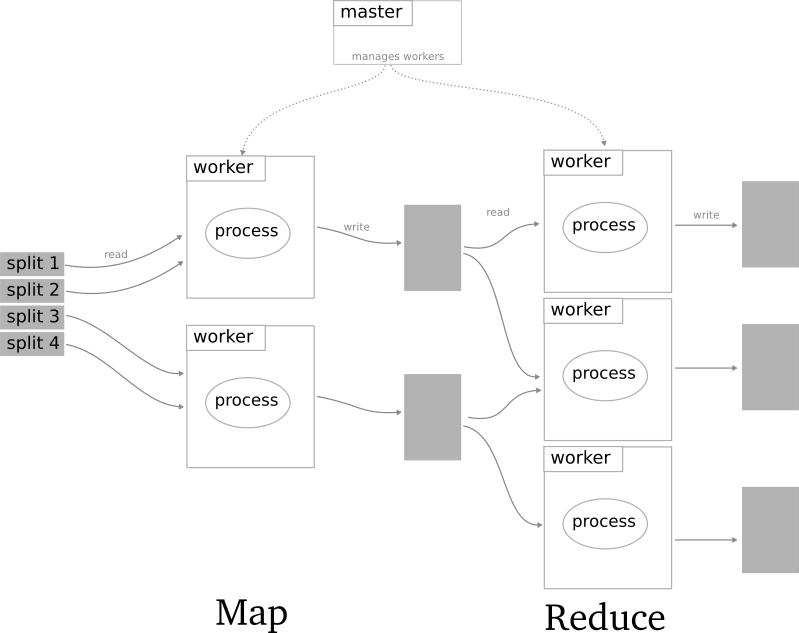

# Blockchain-like Machine Learning
This proposal aims to build a theoretical structure to harden machine learning algorithms against tampering by means of a blockchain-like system.

This proposal makes a focus on distributed processes, which are the type of schemes used in machine learning on big data analysis.

## Motivation
Many modern processes rely, or are in the process of relying, in models that decide what movie to see, what sentence to answer, how probable are that you leave a telephone company, etc. These models are in the field of machine learning.

All of the models contain a set of parameters that define how the algorithm behave and what predictions will do. It is then important to assure these parameters are under control, and are not modify during training, or after it, when the model is deployed.

Current technologies can provide secure communication channels where data can be transfered. Data can also be encrypted in hard disks while resting in there. However, there always exists people with the right privileges to decrypt the disks, or intercept the communications, and modify data at will (probably erasing this modification from logs also). If models' parameters are modified, the predictions made by the models will change and that will affect how the company is making money with them. Models used for profitable purposes cannot be risked by not providing the necessary security

Blockchain is a technology that enables to maintain an unmodifiable data record of communications among nodes in a network. It is then an obvious candidate to secure machine learning algorithms.

In this proposal we are going to explore how a blockchain-like system could be adapted to work on distributed machine learning.

## High-level View

### System Elements

  
* **Data**: machine learning algorithms work with data. An attacker could modified the algorithm's model during the training, by modifying the data. This would results in a distorted model. To avoid this, data to be fed to a model is prevented from tampering by creating a **Merkle tree** of the data.

    In the figure example, we have data in a table. The data has several columns with features of the data. The same data is represented as gray dots on the bottom part of the figure. With this data, organized by an index *id*, a Merkle tree is calculated. Taking the root tree node, and including it in the blockchain assures us that the data cannot be modified.
    
    

        
    

    The size of the tree is approximately  log2(n) being *n* the number of rows on the table (the number of examples). it is important to notice that data does not have to be in the blockchain, only its root tree node hash. To avoid confusion in the explanation, let me explain the naming convention followed in this proposal: **tree node** is a node in  a Merkle tree; **cluster node** is a physical computer belonging to a cluster of computers; **node** is a entity in the blockchain-like paradigm which can interact with other similar entities, whether they are in the same cluster node or in another one.
    
    

* **Node**: every process in a distributed process scheme, would become a node. Every interaction among these nodes is refereed as a *message*. Let us focus on the distributed paradigm most used currently, namely "MapReduce". In this paradigm, a master cluster node acts as coordinator and deliver processes to worker cluster nodes. These workers read the data, perform their computation (the map part) and write the results in files. Another set of workers read the data and perform another computation that reduces the number of computation elements (the reduce part). Finally they write the results into the disk (figure inspired by Dean, J., & Ghemawat, S. (2008). MapReduce: simplified data processing on large clusters. Communications of the ACM, 51(1), 107-113.).

    

            
    

    
    Our approach to harden this paradigm against tampering is to wrap each distributed process in a "bubble" that contains the same process to be executed next to additional parameters, like a hash of the current process parameters (current state) and a hash of the previous parameters of the process (last state). Let us call this wrapper a *bubble machine*. This bubbles creates in fact nodes of the blockchain-like system, so every exchange of information among the "bubbles" are similar to transactions in Bitcoin (here renamed to *messages*).

    

            
    

    The figure shows an example of how a process becomes a node. 

    

            
    
    

    The new node contains:

    * The **same processes** to be performed previously to its conversion
    * A **public address**
    * A **private key** (created with the public key)
    * A **hash of the previous state** on the node the last operation on the node (e.g. performing a computation)
    * A **hash of the state of the node after the computation** (e.g. node parameters updated). This hash includes in the computation the previous state hash. In case of an intentional modification, an attacker would have to recalculate all the states' hashes since the instant of the modification until the present. This hash is broadcasted to the network after each change
    * A **hash of the data read** from the disk in order to perform its computation (e.g. training data)
    * A **hash of the data written** after the computation (e.g. transformed data after a Map computation)

* **Message**: a message contains the information passed through the network. It may contain data in any form. Without the blockchain system, worker nodes, selected by the master node, wrote and read from the same disk space. With the blockchain system, the master node must designate which node will send data to other node, so this communication can be signed by the sender node using its private key. 
  
    Aside from data, a message must include the address of the node to which send the information, and a signature over a hash of the data proving the information sent is correct (just as Bitcoin does). Each message is broadcasted to the network

* **Blockchain**: Each block in the blockchain should include:
    * Previous block hash
    * Hash state of every node
    * Every message sent in its chunk of time
    * Timestamp
    
    As in the case of Bitcoin, periodically, a new block is added to the blockchain. This addition must be verified by other computer (called miners in Bitcoin) by solving a computational challenge. When there is a consensus (51% of computational power) in the solution, the block is added. 
    
    Unlike Bitcoin, in this case, miners does not have an economical incentive to compute the solution. As this scheme is though to be implemented by systems worried by the security of its algorithms, I believed the sole motivation of keeping the models secured could be enough.
    
    
### Uses

This scheme presented can be applied to all the steps of processing of a machine learning algorithm:

* **Training**: messages and nodes' states preserve the process of training from data and updating the model parameters.
* **Test**: once the model is trained, the blockchain continues working, as every prediction is equivalent to a fed of information to the nodes, a computation, and an output result. These processes becomes part of the blockchain also

A higher view of the scheme proposed gives us an intuition that the same scheme can be applied to any distributed process, whether a machine learning one or not. It may be interesting to apply this scheme to e.g. RAID systems, parallel processing etc.

    
    
    

